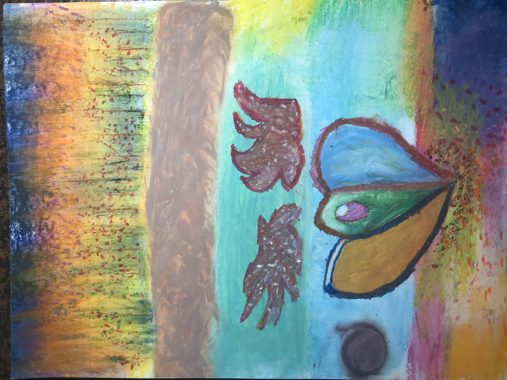
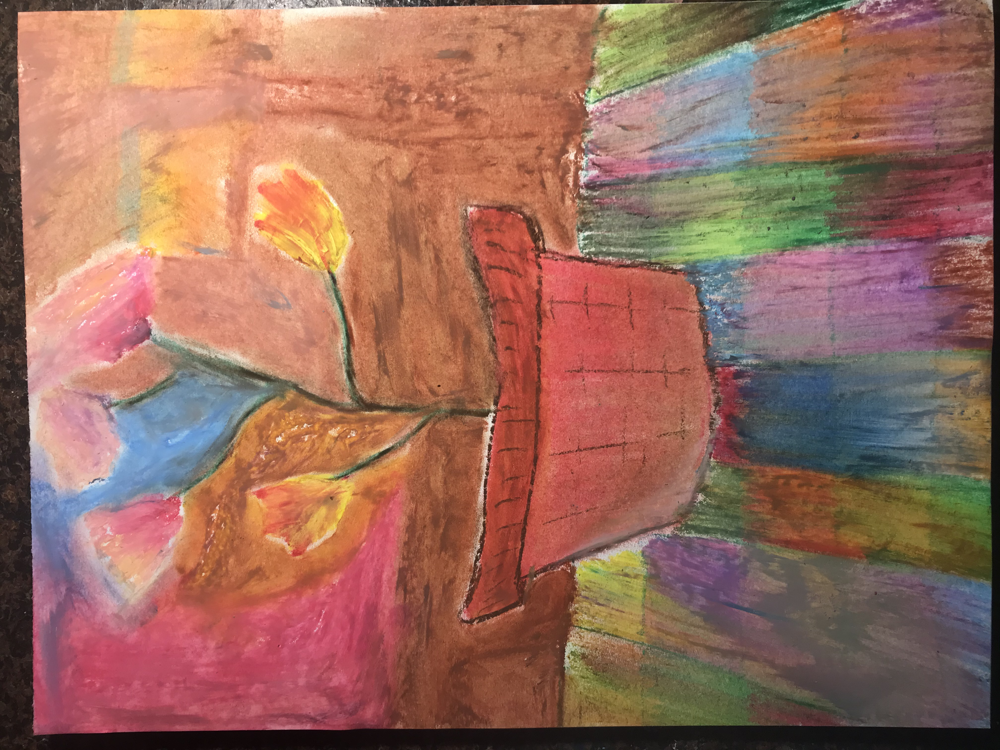
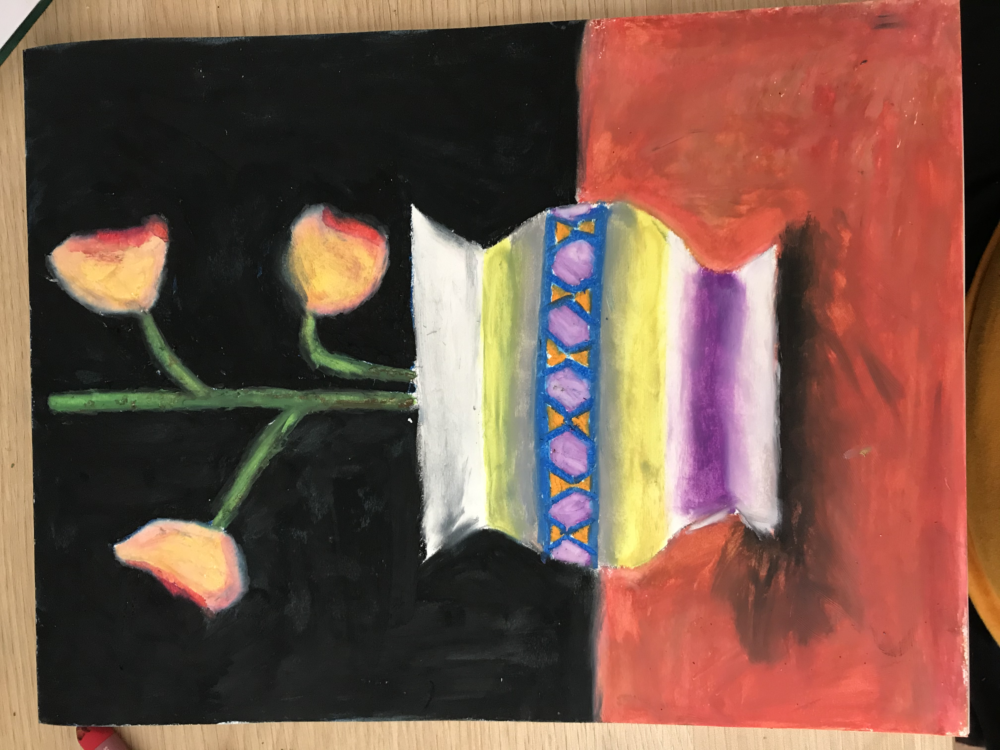
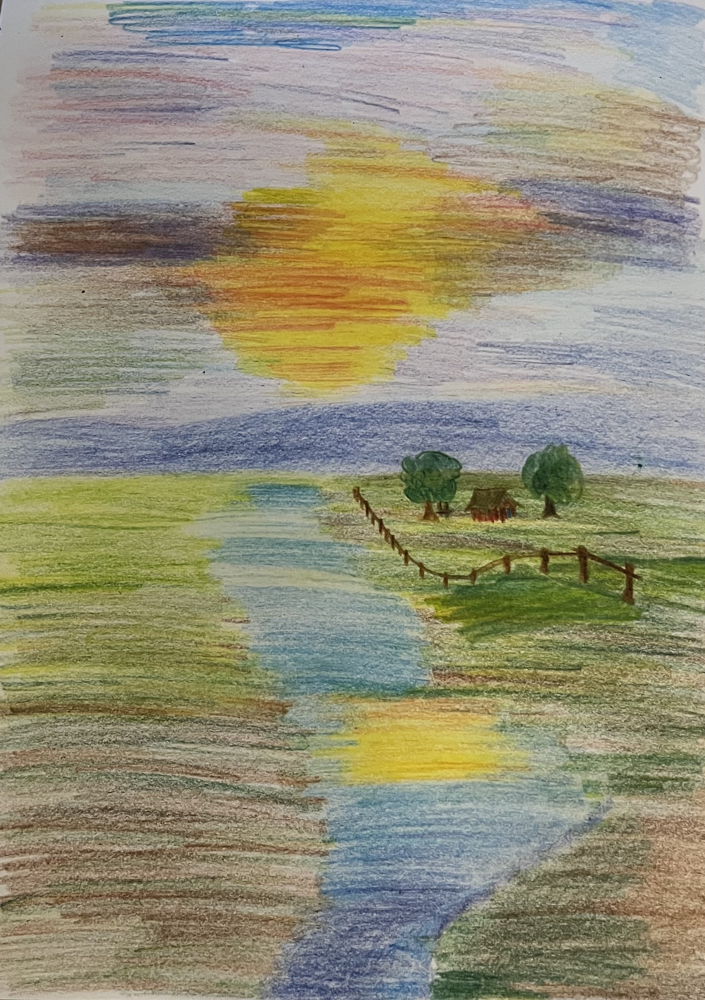
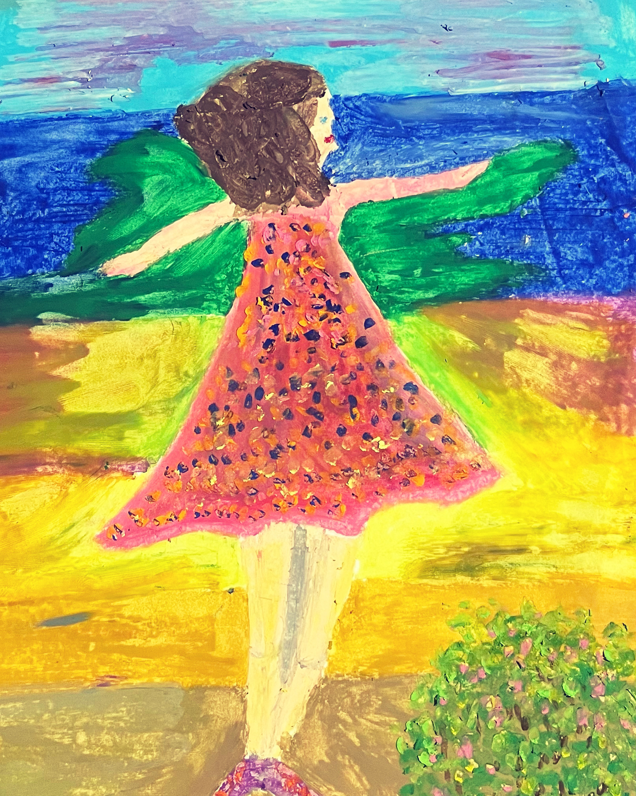
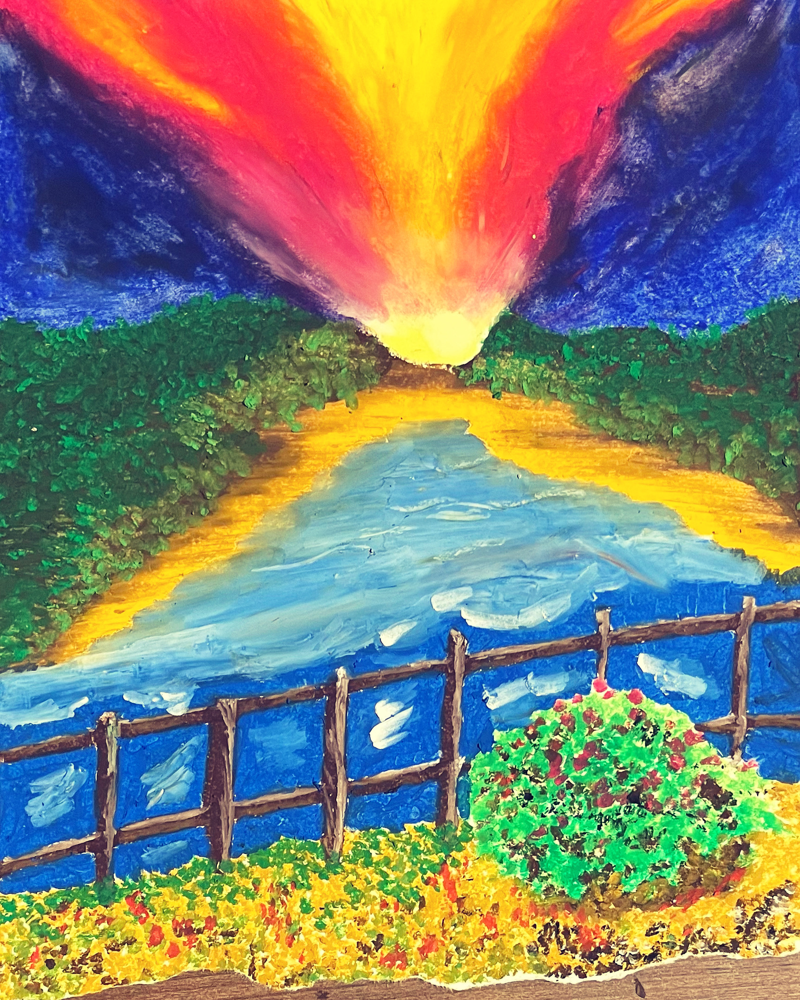
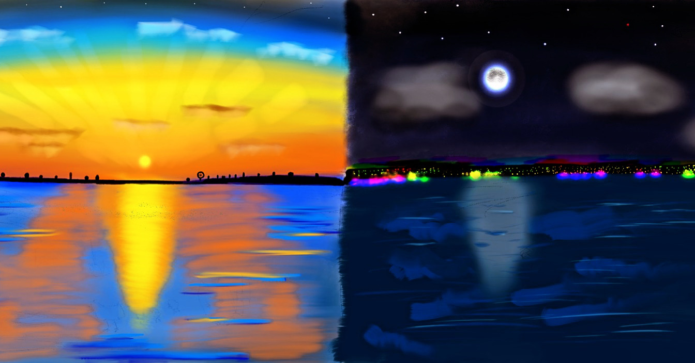
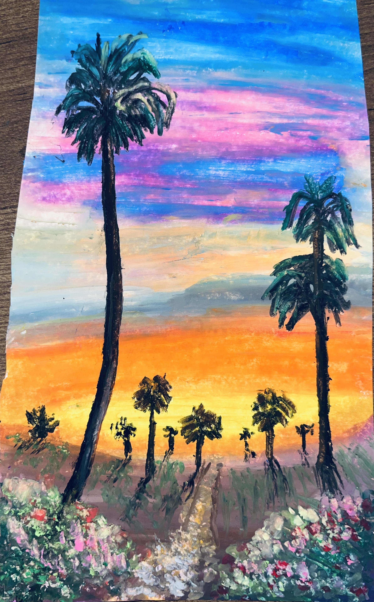
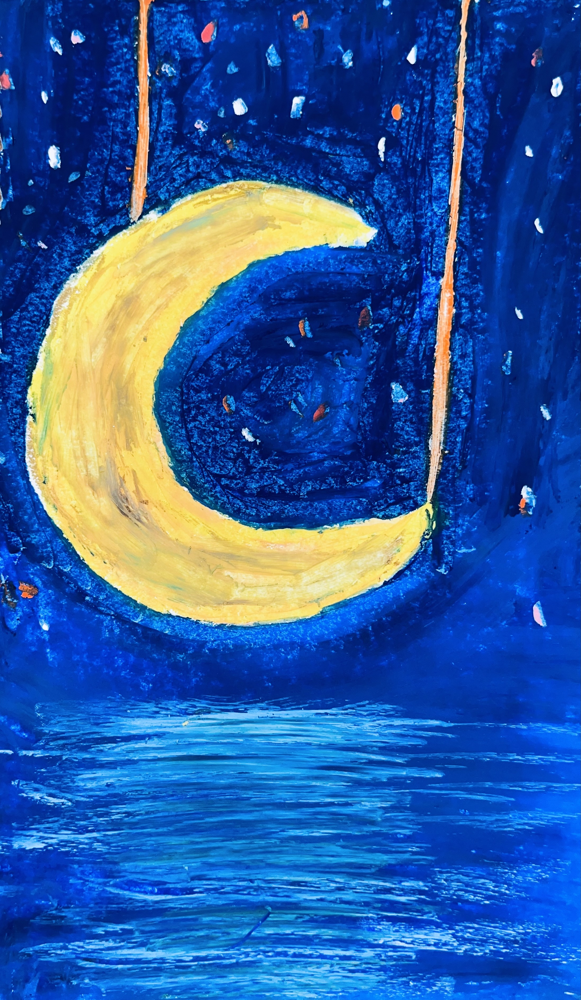

## Hobbies

\[[__Go back__](https://kagsimsek.github.io)\]

Compositions:

[Op. 1 "Preludes" No. 1](https://youtu.be/-ZByj-huV6g)  
[Op. 2 "First Songs" No. 1](https://youtu.be/gq1tjsipeEs)  
[Op. 2 "First Songs" No. 2](https://youtu.be/t15oFLvqEhk)  
[Op. 3 "Valses for M" No. 1](https://youtu.be/dFOjV-_9hEY)  
[Op. 3 "Valses for M" No. 2](https://youtu.be/SUrrblUNAP0)  
[Op. 3 "Valses for M" No. 3](https://youtu.be/-hoTo_rcclw)  
[Op. 3 "Valses for M" No. 4](https://youtu.be/Yt47mBAHQyk)  
[Op. 4 "Sleep without a Pillow" No. 1 "Magic"](https://youtu.be/8MHF4ypmXWA)  
[Op. 4 "Sleep without a Pillow" No. 2 "Ad Infinitum"](https://youtu.be/8xjI1-Kbe54)  
[Op. 4 "Sleep without a Pillow" No. 3 "Gnawn"](https://youtu.be/Jyh-Q-hpT4Y)  
[Op. 4 "Sleep without a Pillow" No. 4 "Gemütlichkeit"](https://youtu.be/p_JRFiuU0MM)  
[Op. 4 "Sleep without a Pillow" No. 5 "I've Got a Crush on You"](https://youtu.be/So46kRUskrg)  
[Op. 4 "Sleep without a Pillow" No. 6 "Ergo, Sum"](https://youtu.be/-pt8LdupRos)  
[Op. 5 "Impressions" No. 1 "Lavinia" Pt. 1](https://youtu.be/PxnqKZSM-xk)  
[Op. 5 "Impressions" No. 1 "Lavinia" Pt. 2](https://youtu.be/2OK6uUleXxM)  
[Op. 5 "Impressions" No. 2 "Pale Blue Eyes"](https://youtu.be/V8Byt4CPfjA)  
[Op. 5 "Impressions" No. 3 "What Remains"](https://youtu.be/WOQjCSqKwaE)  
[Op. 5 "Impressions" No. 4 "Waltz"](https://youtu.be/a1jTfJQsNLY)  
[Op. 5 "Impressions" No. 5 "Nearness of You"](https://youtu.be/HzKv1qJlxNg)  
[Op. 5 "Impressions" No. 6 "Minute Waltz"](https://youtu.be/xTVgUUZ3TbA)  

Follow me on [YouTube](https://www.youtube.com/channel/UCZyXHA37ucmJQfbALDMd5vQ).  
Follow me on [SoundCloud](https://soundcloud.com/kagsimsek).

Paintings:

Piece I: Not really the mountain

Piece II: Camp by the sea at sunset

Piece III: I had a dream like this

Piece IV: Flowers in the kitchen

Piece V: Flowers in a vase

Piece VI: Boat at sunset

Piece VII: Watermelon

Piece VIII: Gloomy hill

Piece IX: Dancing girl

Piece X: Sunset over creek

Piece XI: Hot summer day, cold winter night

Piece XII: Sunset over desert

Piece XIII: Swinging moon

Follow me on [GitHub](https://github.com/kagsimsek).  
Let's [play chess](https://lichess.org/@/heppier).
