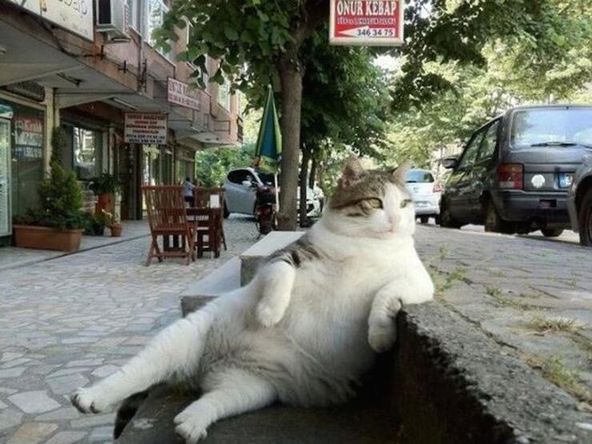
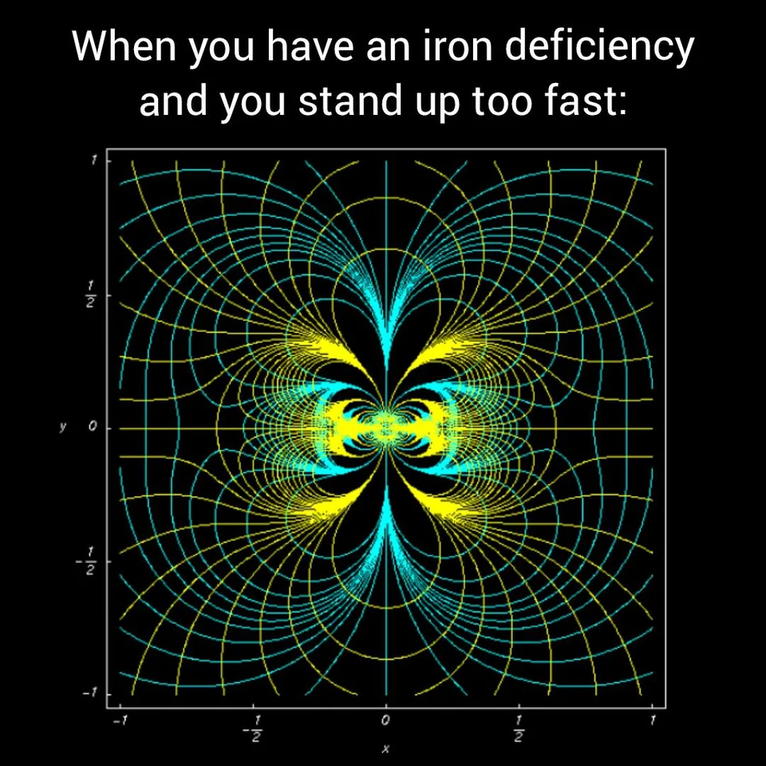

**latest**

compose music using machine learning techniques on python: [`not-so-random compose`](https://github.com/kagsimsek/not-so-random_compose)  

compose music using random sequence of notes on mathematica: [`random compose`](https://github.com/kagsimsek/random_compose)  

follow on [spotify](https://open.spotify.com/artist/61Bqs23yCeYVBvbNtuA5tk?si=S67Hi7erRtq6dhJxLKoM9Q).  

**workplace**

department of physics  
kennesaw state university  
kennesaw, ga 30144  
_starting 8/2025_  

\[[__about__](https://kagsimsek.github.io/about)\]
\[[__misc__](https://kagsimsek.github.io/misc)\]
\[[__tutorials__](https://kagsimsek.github.io/tutorials)\]
\[[__werke__](https://kagsimsek.github.io/werke)\]
\[[__teaching__](https://kagsimsek.github.io/teaching)\]
\[[__suse installation__](https://kagsimsek.github.io/SUSE_installation)\]
\[[__hobbies__](https://kagsimsek.github.io/hobbies)\]
\[[__writing instruments__](https://kagsimsek.github.io/writing_instruments)\]

_la vie est brève_  
_un peu de rêve_  
_un peu d’amour_  
_et puis bonjour!_  

_la vie est vaine_  
_un peu de peine_  
_un peu d’espoir_  
_et peu bonsoir!_  

  
  
  
  
  
_on living_  
  
I  
   
Living is no laughing matter:  
	you must live with great seriousness  
		like a squirrel, for example—  
   I mean without looking for something beyond and above living,  
		I mean living must be your whole occupation.  
Living is no laughing matter:  
	you must take it seriously,  
	so much so and to such a degree  
   that, for example, your hands tied behind your back,  
                                            your back to the wall,  
   or else in a laboratory  
	in your white coat and safety glasses,  
	you can die for people—  
   even for people whose faces you’ve never seen,  
   even though you know living  
	is the most real, the most beautiful thing.  
I mean, you must take living so seriously  
   that even at seventy, for example, you’ll plant olive trees—  
   and not for your children, either,  
   but because although you fear death you don’t believe it,  
   because living, I mean, weighs heavier.  
  
II  
  
Let’s say we’re seriously ill, need surgery—  
which is to say we might not get up  
			from the white table.  
Even though it’s impossible not to feel sad  
			about going a little too soon,  
we’ll still laugh at the jokes being told,  
we’ll look out the window to see if it’s raining,  
or still wait anxiously  
		for the latest newscast. . .   
Let’s say we’re at the front—  
	for something worth fighting for, say.  
There, in the first offensive, on that very day,  
	we might fall on our face, dead.  
We’ll know this with a curious anger,  
        but we’ll still worry ourselves to death  
        about the outcome of the war, which could last years.  
Let’s say we’re in prison  
and close to fifty,  
and we have eighteen more years, say,  
                        before the iron doors will open.  
We’ll still live with the outside,  
with its people and animals, struggle and wind—  
                                I  mean with the outside beyond the walls.  
I mean, however and wherever we are,  
        we must live as if we will never die.  
  
III  
  
This earth will grow cold,  
a star among stars  
               and one of the smallest,  
a gilded mote on blue velvet—  
	  I mean this, our great earth.  
This earth will grow cold one day,  
not like a block of ice  
or a dead cloud even   
but like an empty walnut it will roll along  
	  in pitch-black space . . .   
You must grieve for this right now  
—you have to feel this sorrow now—  
for the world must be loved this much  
                               if you’re going to say “I lived”. . .  
  
_-nazim hikmet_  
  
  
  
  
  

february 2018 -- present
